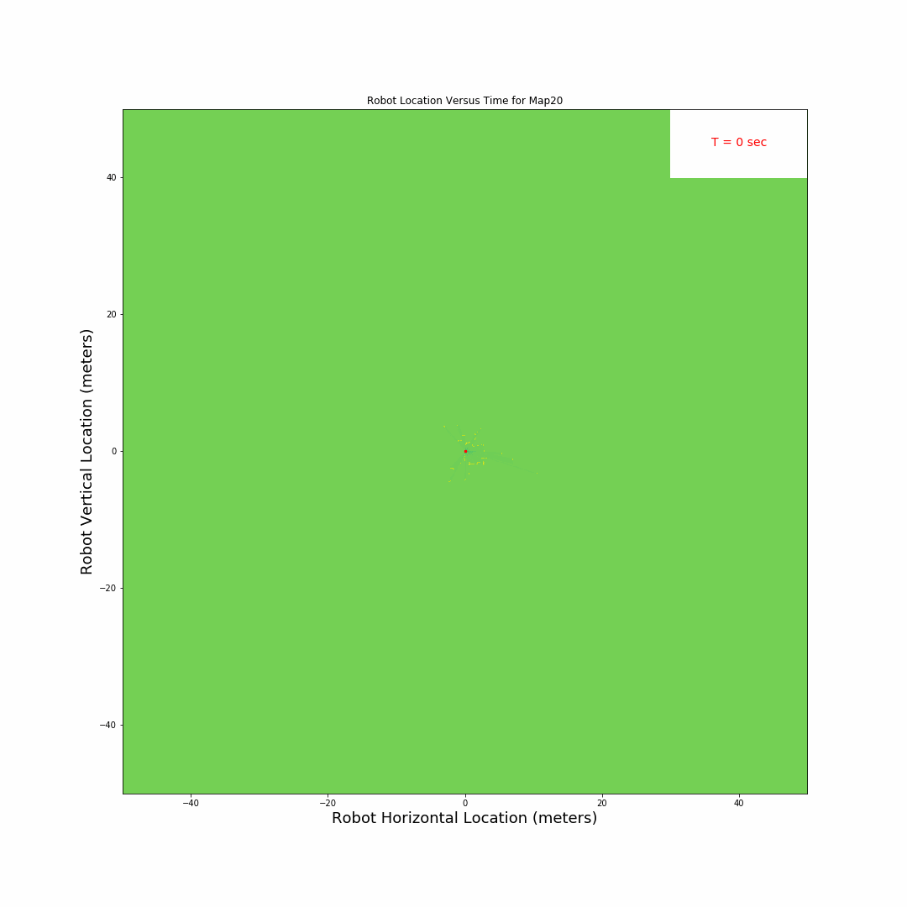
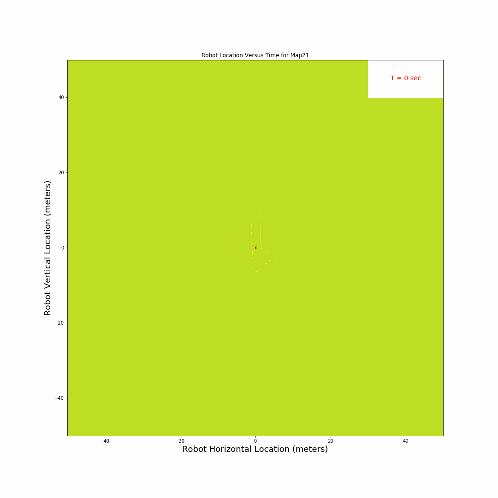
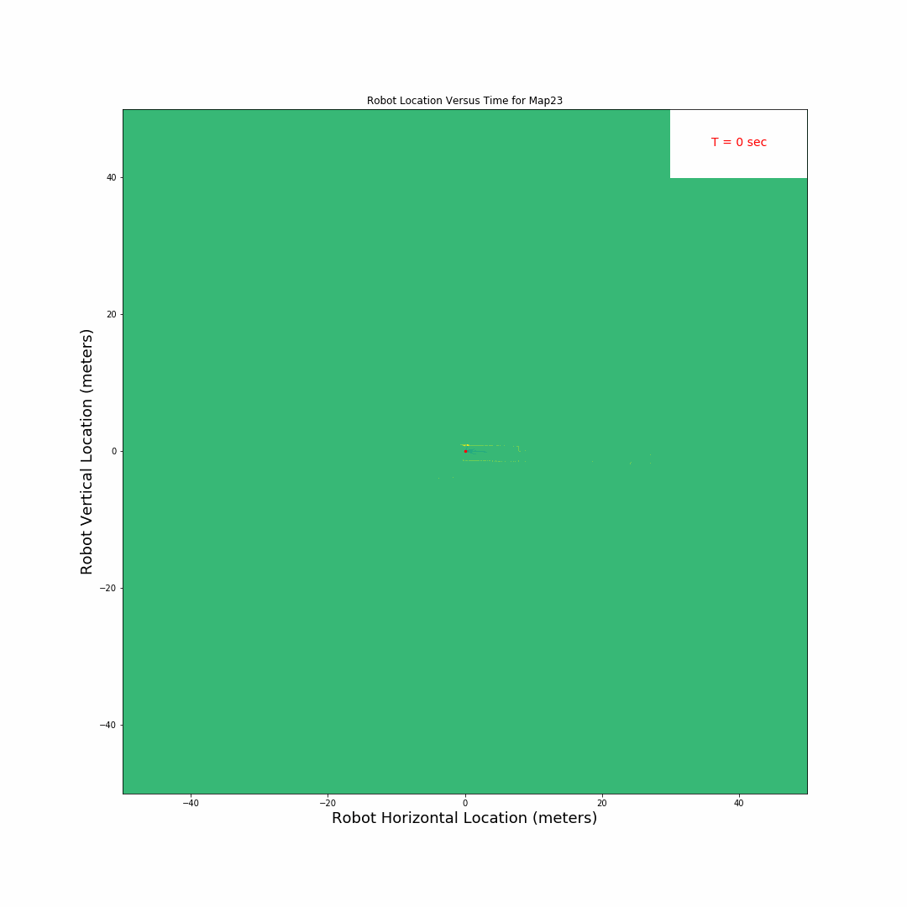
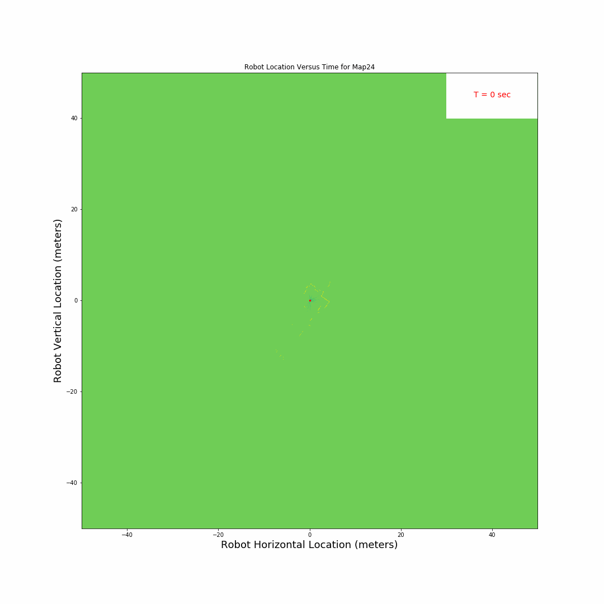

# SLAM
## Simultaneous Localization and Mapping (SLAM)

This repo documents the development of a
two dimensional robot localization and mapping
algorithm based on a purpose-built Sequential
Monte Carlo algorithm.

The model processes discrete wheel rotation data
collected from self-contained wheel encoders, as
well as light radar (LIDAR) detection data over a
270 degree horizontal visual field. In addition, a robot
inertial measurement unit (IMU) provides linear
and angular acceleration data.

Using these inputs, the model iteratively produces
a correlation to observed map landmarks (i.e.:
prior LIDAR returns from objects in the
environment) to predict the most likely location
of the robot. According to this best-estimate
location, landmark location confidences are
incrementally updated using Bayesian inference.

## SLAM Results and Maps

The figures below display the maps obtained
using the SLAM algorithm for maps 20 through
24. These animations also display
the landmark detection process during mapping.

The robot is predicted to start at
coordinate 0,0, at a pose angle of 0 degrees.
Appendix D includes full-page versions of these
figures as well as illustrations of the robot’s best-estimate
path.

